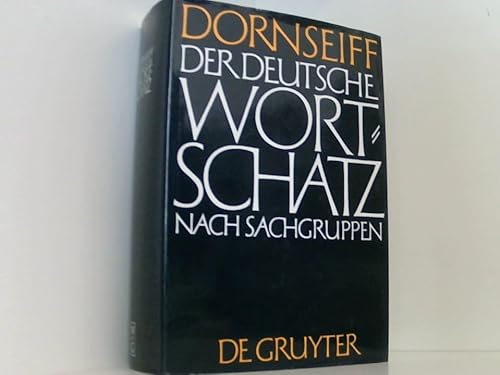
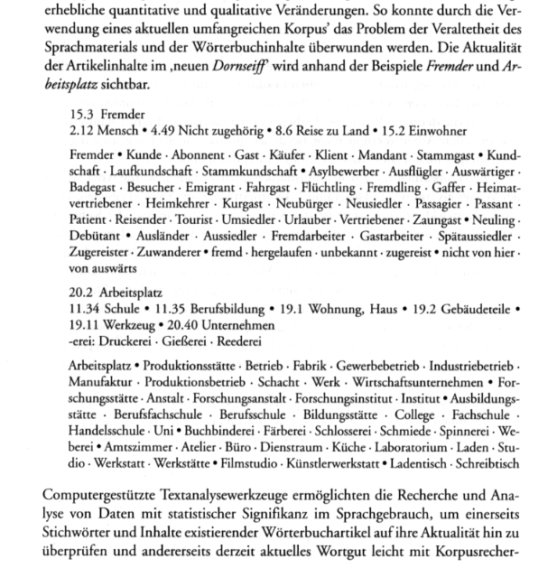
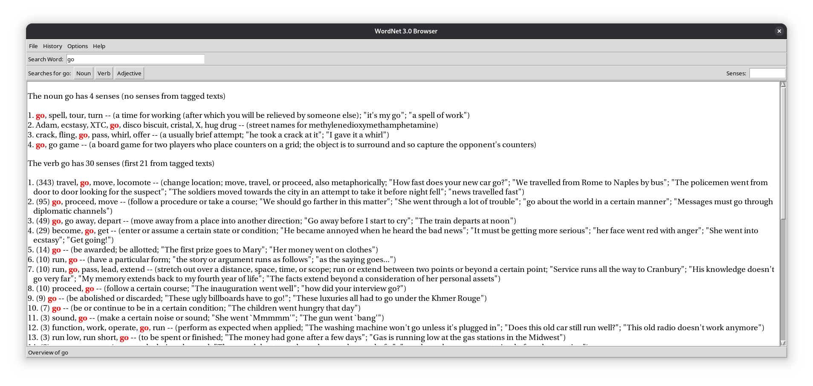
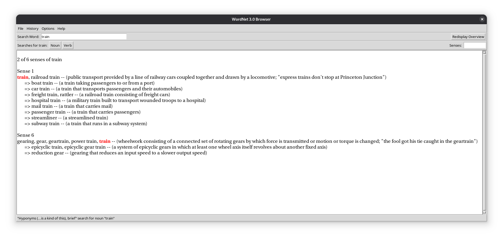
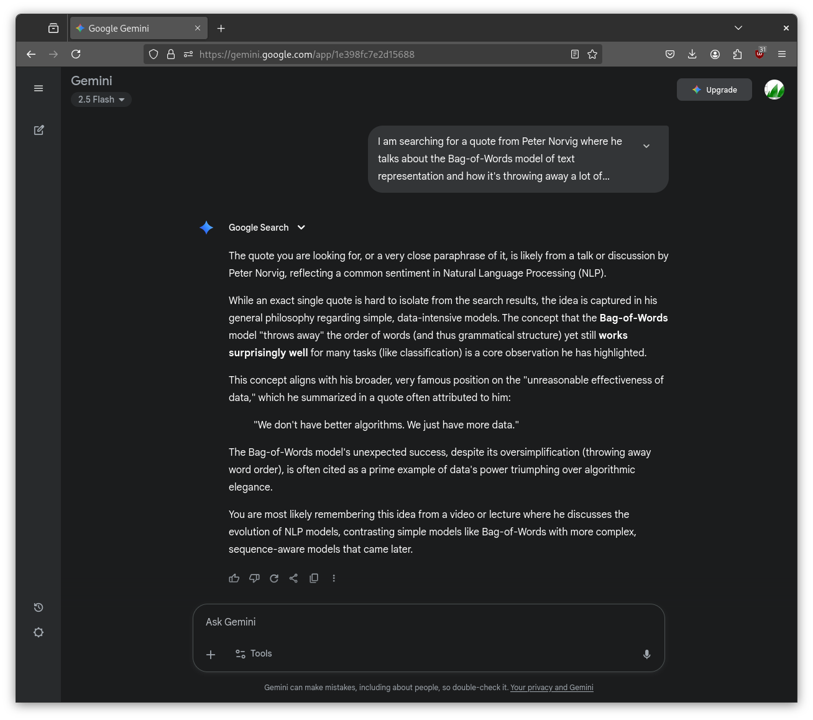
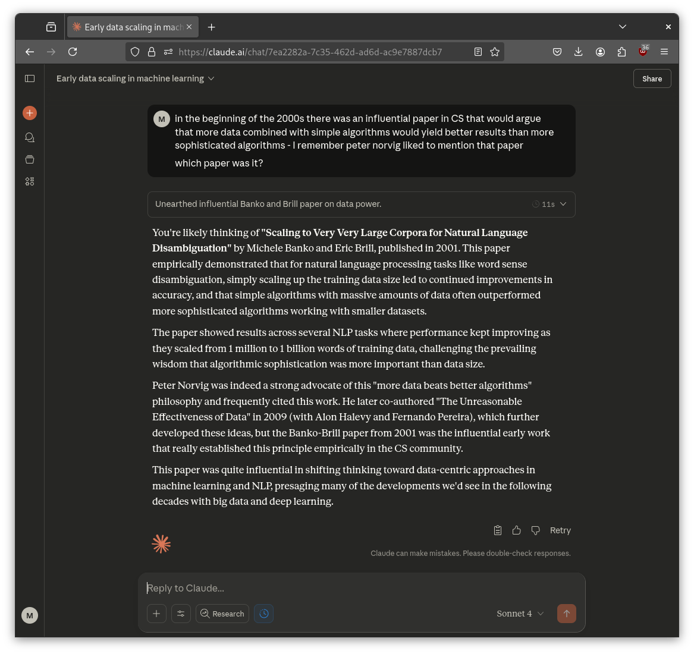
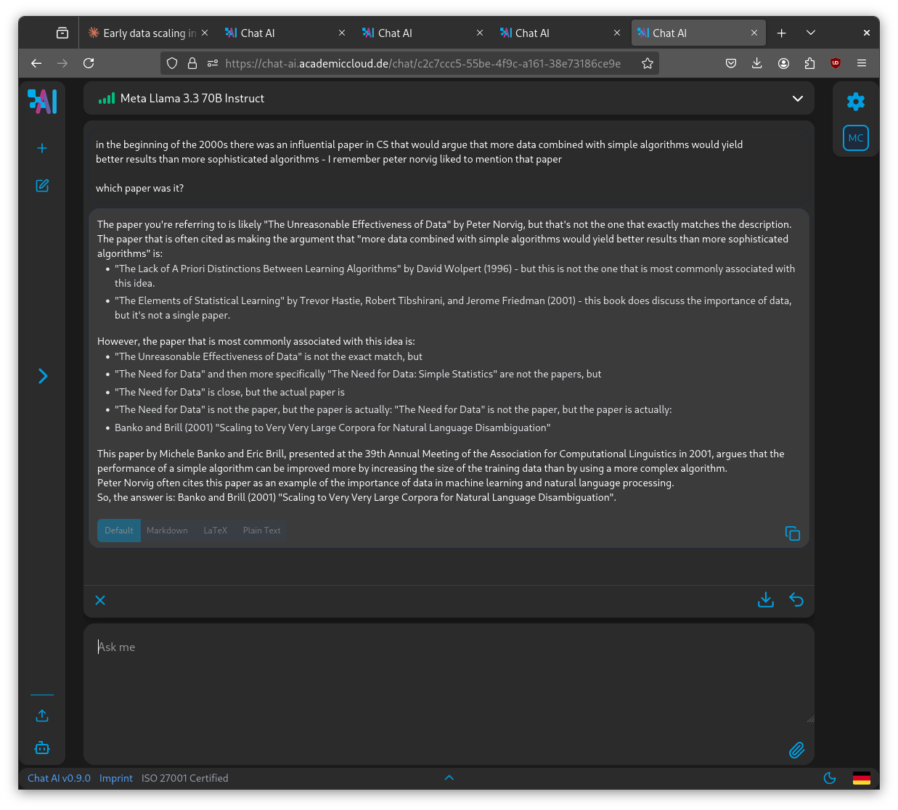
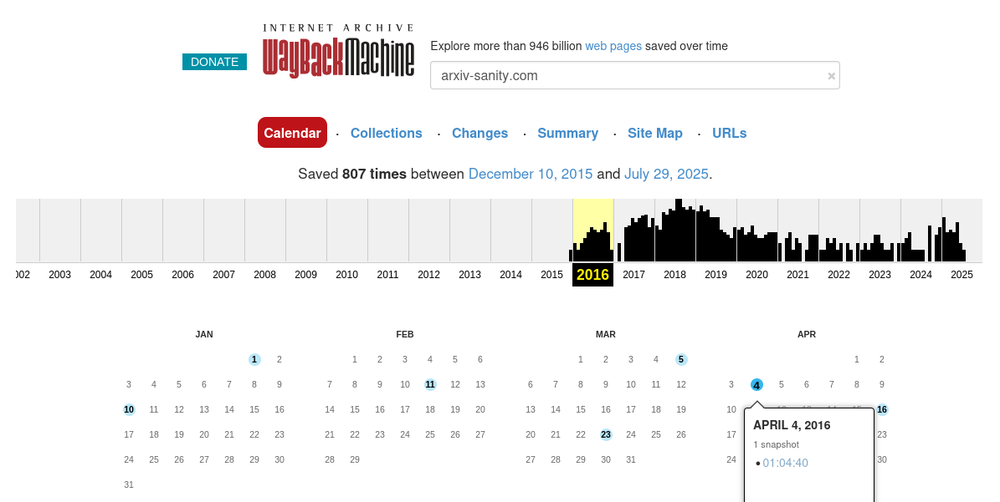
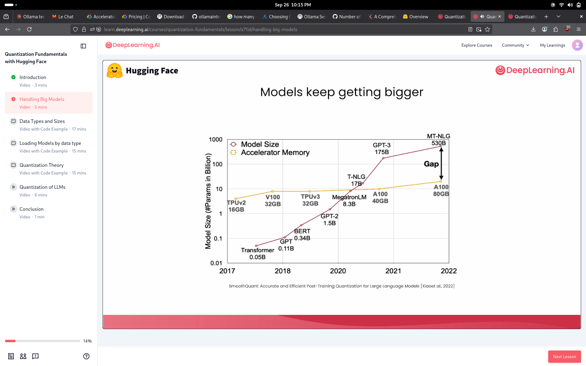

# Background

* interest in NLP since early 2000s,
  [wortschatz](https://wortschatz-leipzig.de/en)
([ex](https://dict.wortschatz-leipzig.de/en/res?corpusId=eng_news_2024&word=Uffizi+Gallery))
at Leipzig University



> 1933/34 unter dem Titel *Der deutsche Wortschatz synonymisch geordnet.* --
> [Dornseiff - Der deutsche Wortschatz nach
> Sachgruppen](https://ids-pub.bsz-bw.de/frontdoor/deliver/index/docId/4961/file/Storjohann_Dornseiff_Der_deutsche_Wortschatz_nach_Sachgruppen_2012.pdf)



Similar, popular, early project: [wordnet](https://en.wikipedia.org/wiki/WordNet):

> WordNet is a lexical database of semantic relations between words that links
> words into semantic relations including synonyms, hyponyms, and meronyms.

```sh
$ sudo apt install wordnet
$ wnb
```





Statistical approach, counting words, sparse representation (bag-of-words), manual curation.



Back then, there was an influencial paper about how more data wins over
algorithms, let me quickly ask an LLM which paper it was?



A few open weights LLMs struggle a bit with this question, but [Meta Llama 3.3
70B Instruct](https://huggingface.co/meta-llama/Llama-3.3-70B-Instruct)
(released December 6, 2024) seems to remember it.



The paper was called: "Scaling to Very Very Large Corpora for Natural Language
Disambiguation" (2001)

> We collected a **1-billion-word** training corpus from a variety of English
> texts, including news articles, scientific abstracts, government transcripts,
> literature and other varied forms of prose. This training corpus is three
> orders of magnitude greater than the largest training corpus previously used
> for this problem.

You can generate 1B words in a few seconds today:

```
$ perf stat -r 1 -B ./1b > words.txt && du -h words.txt

 Performance counter stats for './1b':

          6,588.00 msec task-clock                       #    1.005 CPUs utilized
             4,216      context-switches                 #  639.951 /sec
                19      cpu-migrations                   #    2.884 /sec
               100      page-faults                      #   15.179 /sec
     6,480,220,375      cpu_atom/cycles/                 #    0.984 GHz                         (0.11%)
    24,934,230,875      cpu_core/cycles/                 #    3.785 GHz                         (99.45%)
     9,898,653,980      cpu_atom/instructions/           #    1.53  insn per cycle              (0.27%)
   122,415,155,922      cpu_core/instructions/           #    4.91  insn per cycle              (99.45%)
     2,911,671,826      cpu_atom/branches/               #  441.966 M/sec                       (0.35%)
    26,063,374,535      cpu_core/branches/               #    3.956 G/sec                       (99.45%)
        39,141,727      cpu_atom/branch-misses/          #    1.34% of all branches             (0.53%)
         4,678,785      cpu_core/branch-misses/          #    0.02% of all branches             (99.45%)
             TopdownL1 (cpu_core)                 #     10.6 %  tma_backend_bound
                                                  #      0.8 %  tma_bad_speculation
                                                  #     13.0 %  tma_frontend_bound
                                                  #     75.7 %  tma_retiring             (99.45%)
             TopdownL1 (cpu_atom)                 #     16.6 %  tma_bad_speculation
                                                  #     30.4 %  tma_retiring             (0.55%)
                                                  #     17.1 %  tma_backend_bound
                                                  #     35.9 %  tma_frontend_bound       (0.47%)

       6.556773774 seconds time elapsed

       5.171633000 seconds user
       1.444366000 seconds sys


4.7G    words.txt
```

## Some events and milestones

Cf. [arxiv sanity](https://github.com/karpathy/arxiv-sanity-preserver) (2016)



On the research side:

* 2003 "a neural probabilistic language model" (Y. Bengio et al.)
* 2013 word2vec (dense static vectors)
* 2014 fasttext (subword tokens)
* 2017 attention is all you need (no more recurrence, "transformer")
* 2018 BERT (comprehension) and original GPT-1 (generation)

...

> By the end of 2018, the field of NLP was about to undergo another
seismic change, marking the beginning of the era of foundation models -- [On
the Opportunities and Risks of Foundation
Models](https://arxiv.org/pdf/2108.07258)

* 2019 Language models are unsupervised multitask learners
* 2019 "bitter lesson"
* 2020 Language models are few shot learners
* 2020 "scaling laws"
* 2021 A General Language Assistant as a Laboratory for Alignment
* 2021 On the Opportunities and Risks of Foundation Models
* 2022 LLM are zero shot learners
* ...

List of open llms: [open-llms](https://github.com/eugeneyan/open-llms?tab=readme-ov-file#open-llms)

On the tooling/data side:

* 2015 tensorflow, keras
* 2016 pytorch
* 2018 jax, `pytorch_pretrained_bert` (later renamed HF transformers)
* 2020 "the pile" (800gb dataset)
* ...
* 2022-09-18 ggml (initial release)
* 2023-03-10 llama.cpp (initial release)
* 2023-07-20 ollama (initial release, support for two models)

And numerous more...

> Personal timeline:

* 2023-02-14, I ask a question on how long before we can run things locally at the [Leipzig Python User Group](https://lpug.github.io/) -- personally, I expected 2-5 years timeline
* 2023-04-18, we discuss C/GO and ggml (ai-on-the-edge) at [Leipzig Gophers #35](https://golangleipzig.space/posts/meetup-35-wrapup/)
* 2023-07-20, [ollama](https://ollama.ai) is released (with two models), [HN](https://news.ycombinator.com/item?id=36802582)
* 2023-11-21, 43 models (each with a couple of tags/versions)
* 2025-10-05, 100+ models, finetunes, language and multimodal models


## What makes local LLM more practical?

* quantization techniques, cf. [quantization](https://huggingface.co/docs/transformers/v4.56.2/quantization/overview)

> A research field, Quantization in deep learning, aim to reduce the high cost
> of computations and memory by representing the weights and activation in deep
> learning models with low precision data types. -- [A Comprehensive Study on Quantization Techniques for Large Language Models](https://arxiv.org/pdf/2411.02530v1)



From [SmoothQuant: Accurate and Efficient Post-Training Quantization for Large Language Models](https://arxiv.org/pdf/2211.10438)

* efficient formats (GGUF)
