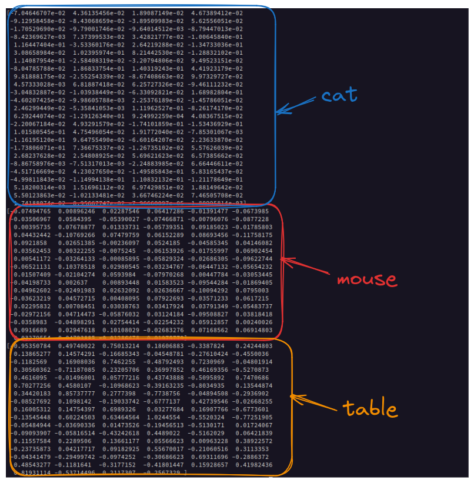
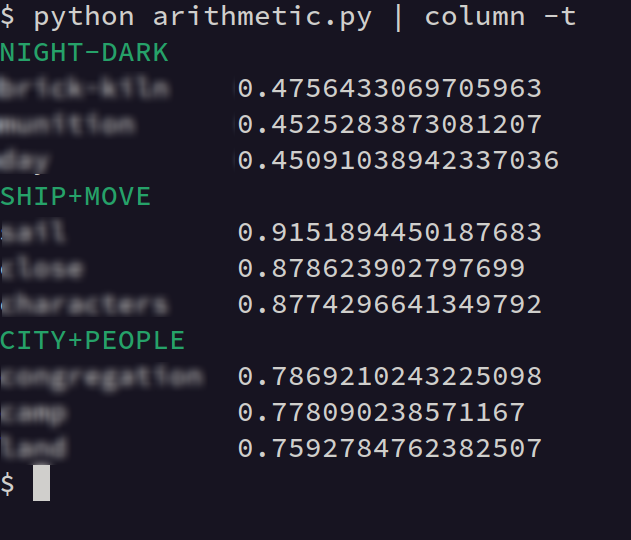

# Word2Vec

Convert word into lower dimensional vector. Similar words should map to similar
vectors. Trained self-supervised on text, guessing context words from a word or
guess a word from a context.

> [Efficient Estimation of Word Representations in Vector Space](https://arxiv.org/abs/1301.3781) (2013)

* dense representations

Example in python:

* [x/word2vec/](x/word2vec)

<!--  -->

Quick quiz:

Training corpus: corpus.file: 1096052 words, vocab: 32922, mostly "bible" (via [gutenberg.org](https://gutenberg.org))

> [unblurred](static/artimethic_0.png)

