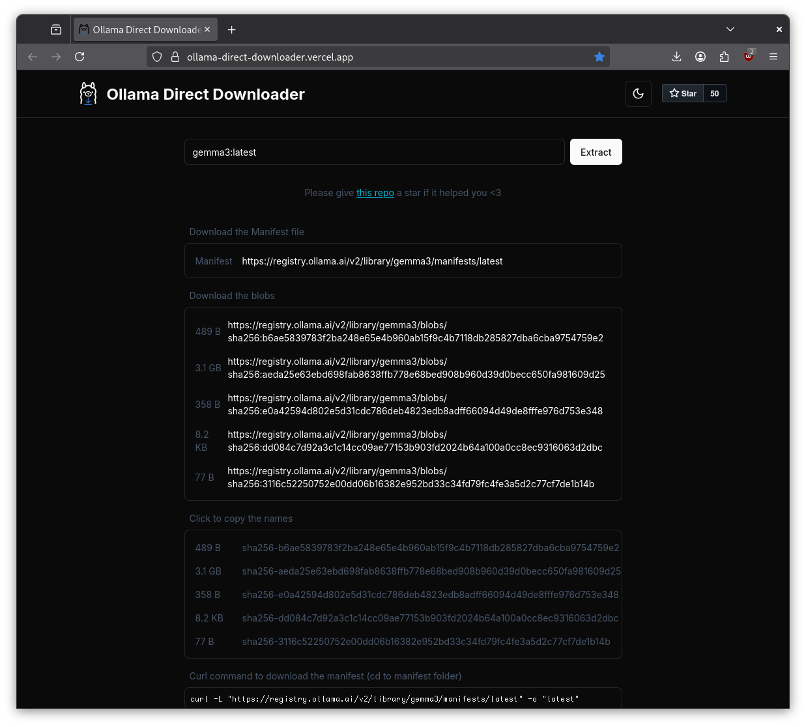

# More on models

* ollama library lists models in the default registry:
  [library](https://ollama.com/library); also [list in
README](https://github.com/ollama/ollama/?tab=readme-ov-file#model-library)
* between 815MB ("gemma3:1b") and 404GB ("deepseek-r1:671b") in size

> You should have at least 8 GB of RAM available to run the 7B models, 16 GB to
> run the 13B models, and 32 GB to run the 33B models. --
> [README.md](https://github.com/ollama/ollama/)

* HF support ollama: [https://huggingface.co/docs/hub/en/ollama](https://huggingface.co/docs/hub/en/ollama)

As of 2025, ollama support a number of model capabilities:

```go
package model

type Capability string

const (
    CapabilityCompletion = Capability("completion")
    CapabilityTools      = Capability("tools")
    CapabilityInsert     = Capability("insert")
    CapabilityVision     = Capability("vision")
    CapabilityEmbedding  = Capability("embedding")
    CapabilityThinking   = Capability("thinking")
)

func (c Capability) String() string {
    return string(c)
}
```

* completion
* tools
* insert
* vision
* embedding
* thinking


Not supported: audio, video

## Modalities

* completion is the basic text interaction
* tools; [x/toolcall](x/toolcall)
* insert (adds a suffix, e.g. code completion)
* vision: joint text and image models, captioning, OCR, ...
* embedding: maps data into a dense vector space
* thinking ...

Test-time compute scaling; more tokens, better responses; related to prompt
engineering, CoT - mostly empiric. Thinking token, delimiter for "<think>" ...;
can be turned on off. Cf. deepseek-r1 ("[Incentivizing Reasoning Capability in
LLMs via Reinforcement Learning](https://arxiv.org/abs/2501.12948)" - cited by
[4110](https://scholar.google.com/scholar?cluster=2469397274690356930)); "trained on question/answer pairs"


### Registry

* model name will get resolved to the registry manifest
* find direct links: [https://ollama-direct-downloader.vercel.app/](https://ollama-direct-downloader.vercel.app/)

[](https://ollama-direct-downloader.vercel.app/)

```sh
$ curl -sL "https://registry.ollama.ai/v2/library/gemma3/manifests/latest" | jq .
{
  "schemaVersion": 2,
  "mediaType": "application/vnd.docker.distribution.manifest.v2+json",
  "config": {
    "mediaType": "application/vnd.docker.container.image.v1+json",
    "digest": "sha256:b6ae5839783f2ba248e65e4b960ab15f9c4b7118db285827dba6cba9754759e2",
    "size": 489
  },
  "layers": [
    {
      "mediaType": "application/vnd.ollama.image.model",
      "digest": "sha256:aeda25e63ebd698fab8638ffb778e68bed908b960d39d0becc650fa981609d25",
      "size": 3338792448
    },
    {
      "mediaType": "application/vnd.ollama.image.template",
      "digest": "sha256:e0a42594d802e5d31cdc786deb4823edb8adff66094d49de8fffe976d753e348",
      "size": 358
    },
    {
      "mediaType": "application/vnd.ollama.image.license",
      "digest": "sha256:dd084c7d92a3c1c14cc09ae77153b903fd2024b64a100a0cc8ec9316063d2dbc",
      "size": 8432
    },
    {
      "mediaType": "application/vnd.ollama.image.params",
      "digest": "sha256:3116c52250752e00dd06b16382e952bd33c34fd79fc4fe3a5d2c77cf7de1b14b",
      "size": 77
    }
  ]
}
```

### Huggingface

* support for ollama on the site: [https://huggingface.co/docs/hub/en/ollama](https://huggingface.co/docs/hub/en/ollama)
* format: `hf.co/{username}/{repository}`

```
$ ollama run hf.co/DevQuasar/swiss-ai.Apertus-8B-Instruct-2509-GGUF:Q4_K_M
```

> By default, the `Q4_K_M` quantization scheme is used, when it’s present inside the model repo.

### Custom Server

* you can use the API to register blobs and then name a model that references the blobs
