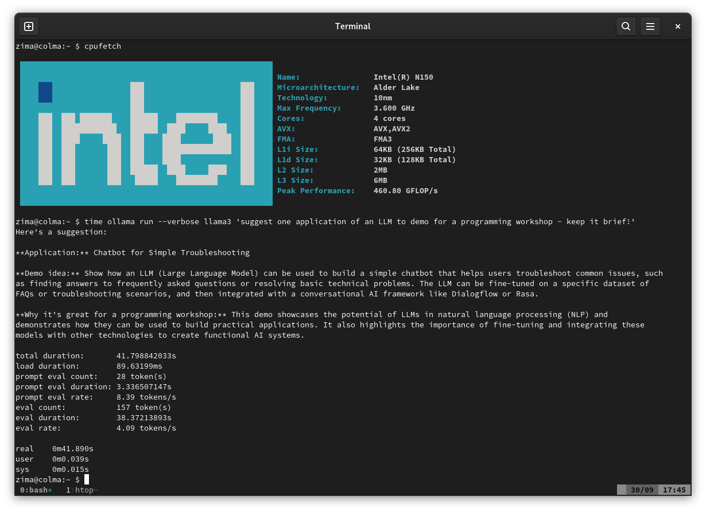
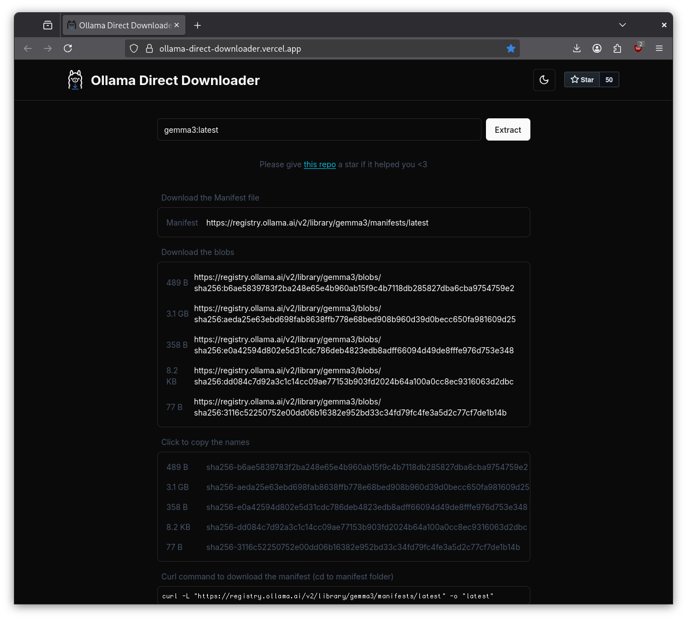

# Ollama Intro Workshop

> Workshop at [GoLab](https://golab.io) 2025, 2025-10-05, [Martin
> Czygan](https://de.linkedin.com/in/martin-czygan-58348842)

## Intro and setup

* [Intro](10-Intro.md)
* [Motivation](15-Motivation.md)

## LLM background and milestones

* [Background](20-Background.md)

## ollama cli

* cli talks with the server

```sh
$ ollama
Usage:
  ollama [flags]
  ollama [command]

Available Commands:
  serve       Start ollama
  create      Create a model
  show        Show information for a model
  run         Run a model
  stop        Stop a running model
  pull        Pull a model from a registry
  push        Push a model to a registry
  signin      Sign in to ollama.com
  signout     Sign out from ollama.com
  list        List models
  ps          List running models
  cp          Copy a model
  rm          Remove a model
  help        Help about any command

Flags:
  -h, --help      help for ollama
  -v, --version   Show version information

Use "ollama [command] --help" for more information about a command.
```

## Running a model

```
$ ollama run llama3:latest
```

* download model from default registry to local cache
* drops you into a chat interface

[](https://github.com/miku/ollamaintro/blob/main/static/ollama-chat-n150-llama3.gif?raw=true)

You can pass a prompt directly as an argument.


## What models?

* ollama library lists models in the default registry:
  [library](https://ollama.com/library); also [list in
README](https://github.com/ollama/ollama/?tab=readme-ov-file#model-library)
* between 815MB ("gemma3:1b") and 404GB ("deepseek-r1:671b") in size

> You should have at least 8 GB of RAM available to run the 7B models, 16 GB to
> run the 13B models, and 32 GB to run the 33B models. --
> [README.md](https://github.com/ollama/ollama/)

* HF support ollama: [https://huggingface.co/docs/hub/en/ollama](https://huggingface.co/docs/hub/en/ollama)


### Registry

* model name will get resolved to the registry manifest

[](https://ollama-direct-downloader.vercel.app/)

```sh
$ curl -sL "https://registry.ollama.ai/v2/library/gemma3/manifests/latest" | jq .
{
  "schemaVersion": 2,
  "mediaType": "application/vnd.docker.distribution.manifest.v2+json",
  "config": {
    "mediaType": "application/vnd.docker.container.image.v1+json",
    "digest": "sha256:b6ae5839783f2ba248e65e4b960ab15f9c4b7118db285827dba6cba9754759e2",
    "size": 489
  },
  "layers": [
    {
      "mediaType": "application/vnd.ollama.image.model",
      "digest": "sha256:aeda25e63ebd698fab8638ffb778e68bed908b960d39d0becc650fa981609d25",
      "size": 3338792448
    },
    {
      "mediaType": "application/vnd.ollama.image.template",
      "digest": "sha256:e0a42594d802e5d31cdc786deb4823edb8adff66094d49de8fffe976d753e348",
      "size": 358
    },
    {
      "mediaType": "application/vnd.ollama.image.license",
      "digest": "sha256:dd084c7d92a3c1c14cc09ae77153b903fd2024b64a100a0cc8ec9316063d2dbc",
      "size": 8432
    },
    {
      "mediaType": "application/vnd.ollama.image.params",
      "digest": "sha256:3116c52250752e00dd06b16382e952bd33c34fd79fc4fe3a5d2c77cf7de1b14b",
      "size": 77
    }
  ]
}
```

### Huggingface

* support for ollama on the site: [https://huggingface.co/docs/hub/en/ollama](https://huggingface.co/docs/hub/en/ollama)
* format: `hf.co/{username}/{repository}`

```
$ ollama run hf.co/DevQuasar/swiss-ai.Apertus-8B-Instruct-2509-GGUF:Q4_K_M
```

> By default, the `Q4_K_M` quantization scheme is used, when it’s present inside the model repo.

### Custom Server

* you can use the API to register blobs and then name a model that references the blobs

## Quantization

* model size depends on number of parameters, typically millions, billions, up to trillions
* one technique to reduce model size (other: lora, pruning, knowledge
  destillation, parameter sharing; cf. [model shrinking
techniques](https://web.dev/articles/llm-sizes#model-shrinking))
* quantization results in an quantization error, the less the better

> Quantization: Reducing the precision of weights from floating-point numbers
> (such as, 32-bit) to lower-bit representations (such as, 8-bit).

Common data types:

* FP32 (full precision)
* FP16 (half precision)
* BF16 (a shortened 16-bit version of 32-bit floats)

> It preserves the approximate dynamic range of 32-bit floating-point numbers
> by retaining 8 exponent bits, but supports only an 8-bit precision rather
> than the 24-bit significand of the binary32 format. -- [bfloat16 floating-point format](https://en.wikipedia.org/wiki/Bfloat16_floating-point_format)

> Our results show that deep learning training using BFLOAT16 tensors achieves
> the same state-of-the-art (SOTA) results across domains as FP32 tensors in
> the same number of iterations and with no changes to hyper-parameters. -- [A Study of BFLOAT16 for Deep Learning Training](https://arxiv.org/pdf/1905.12322)

* INT8 (1 byte)

### Suffixes

* https://huggingface.co/docs/hub/en/gguf#quantization-types
* todo: https://medium.com/@paul.ilvez/demystifying-llm-quantization-suffixes-what-q4-k-m-q8-0-and-q6-k-really-mean-0ec2770f17d3

Deep dive: [A Visual Guide to Quantization](https://www.maartengrootendorst.com/blog/quantization/)

## Using the API

* todo: curl
* todo: parameters
* todo: using the API from Go, SDK

## What are the different model types?

* [Model Types](42-Model-Types.md)


## Working with a text model

### Single completion

### Chat completion


## Working with an image model

### Passing an image


## Working with an embedding model

## Request Trace

* [Request Trace](60-Request-Trace.md)

## Tokenization

* character tokens
* word tokens
* subword tokens

### BPE in Go

* todo: BPE in go


