# Ollama Intro Workshop

> Workshop at [GoLab](https://golab.io) 2025, 2025-10-05, [Martin
> Czygan](https://de.linkedin.com/in/martin-czygan-58348842)

## Intro

> Introductory remarks and a note on an already existing language model in the Go
repository you may not have heard about before.

* [Intro](10-Intro.md)

## Motivation

> A list of advantages and disadvantages running your own models, with an example
of a large scale shared community infrastructure in Germany.

* [Motivation](15-Motivation.md)

## Background

> From bag-of-words, to embeddings to large-language models; a recap in ten
> minutes. Let's do some word arithmetic!

* [Background](20-Background.md)

## CLI

> The ollama cli and all the subcommands in a quick tour. Also: a hidden debug
flag that helps to demystify some of the prompt assembly process.

* [ollama cli](25-CLI.md)

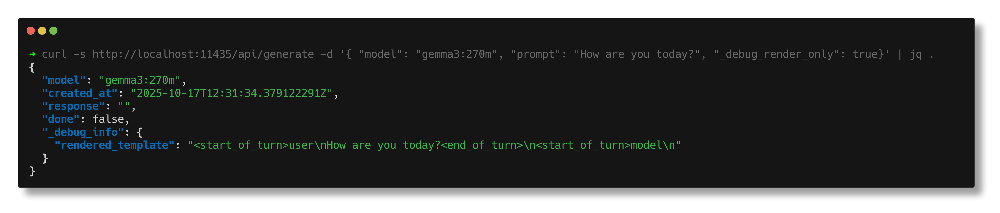

## More on models

> Model types and where to find model files. Ollama uses a registry similar to
Docker with manifests and blobs. Thinking and tool use models are results of
specific fine-tuning, cf. [DeepSeek-R1: Incentivizing Reasoning Capability in
LLMs via Reinforcement Learning](https://arxiv.org/pdf/2501.12948) (2025) and
[Tool Learning with Foundation
Models](https://dl.acm.org/doi/pdf/10.1145/3704435).

* [More on models](28-More-on-Models.md)

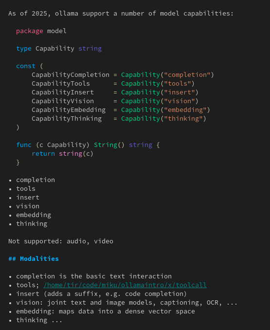

## Model storage

> Model storage on disk, inspired by Docker. One advantage is that models can be
distributed as single files ("Modelfile"), which combine related files (model,
template, license, ...) into one package.

* [Model Storage](31-Model-Storage.md)

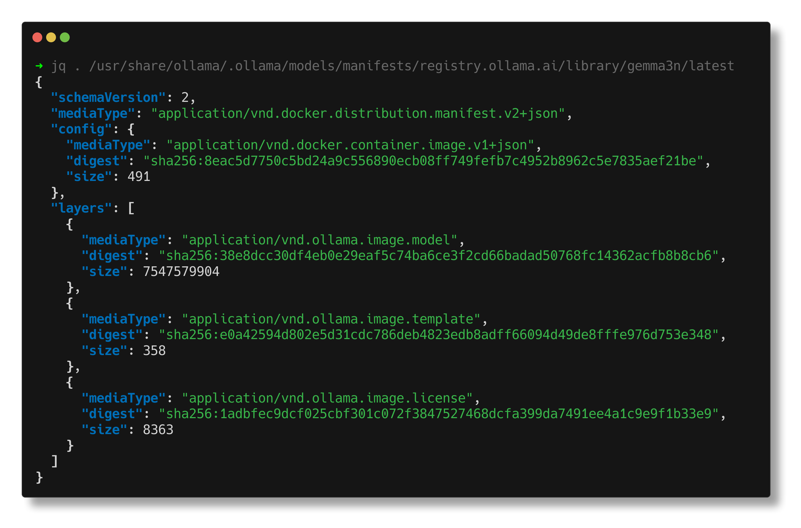

## Quantization

* [Quantization](29-Quantization.md)

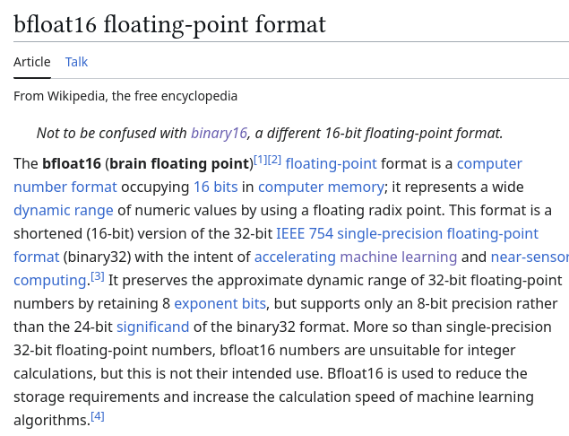

## API and SDK

* [API and SDK](50-API.md)

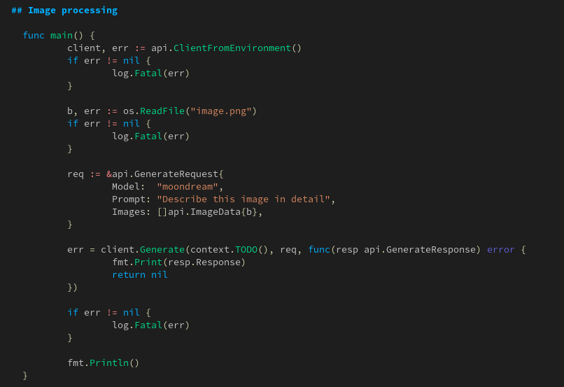

## Request Trace

<!-- * [Request Trace](60-Request-Trace.md) -->

> Tracing a single completion request from the API to the inference core. Ollama
has a scheduler to load and unload models on the fly. The models are running in
subprocesses, which you can see with `ollama ps` subcommand. Default keep alive
time for a model is 5min.

* [Steps](61-Steps.md)

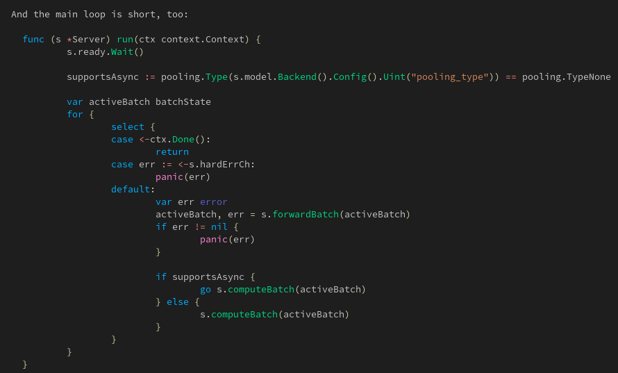

## Tokenization

> Characters are too short, words may be too long. Current tokenizers often operate on
a sub-word level. A popular algorithm, [byte-pair
encoding](https://en.wikipedia.org/wiki/Byte-pair_encoding), is
[originally](https://www.derczynski.com/papers/archive/BPE_Gage.pdf) from
[1994](http://web.archive.org/web/20031027234441/https://www.csse.monash.edu.au/cluster/RJK/Compress/problem.html);
in 2016 it was [adapted for neural machine
translation](https://aclanthology.org/P16-1162.pdf).

* [Tokenization](36-Tokenization.md)

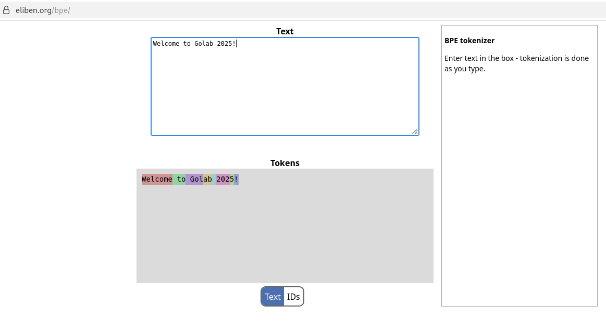

## Customization

> You can try to steer models for specific applications with system prompts. We
looked at three examples.

* [Customization](47-Customization.md)

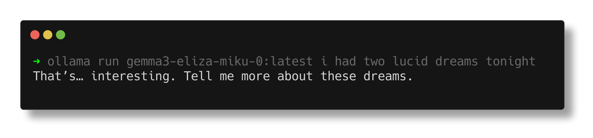

## Project: similarity search

> We chopped up [Sherlock Holmes stories](https://www.gutenberg.org/ebooks/1661) into
> [sentences](https://github.com/neurosnap/sentences). Then we could find
> similar sentences using
> [embeddinggemma](https://developers.googleblog.com/en/introducing-embeddinggemma/).

* [x/simsearch](x/simsearch/)

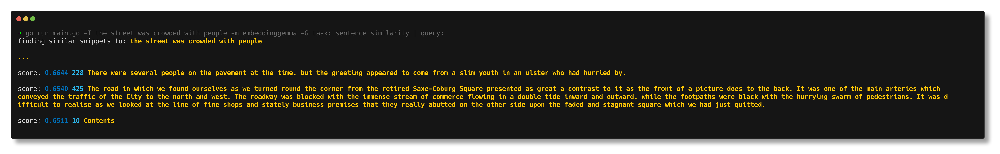

## Project: Grep in images

As a final piece, we let a 6W TDP 16GB RAM
[machine](https://www.zimaspace.com/products/single-board2-server) running an
[Intel
N150](https://www.intel.de/content/www/de/de/products/sku/241636/intel-processor-n150-6m-cache-up-to-3-60-ghz/specifications.html)
run a multimodal model ("qwen2.5vl") running handwritten text recognition. It
took a bit, but worked!

* [x/imgrep](x/imgrep)

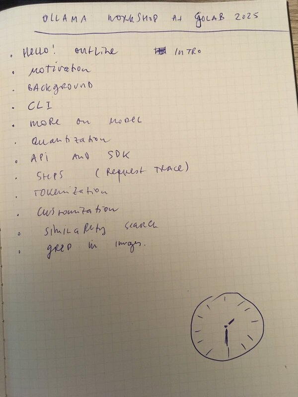

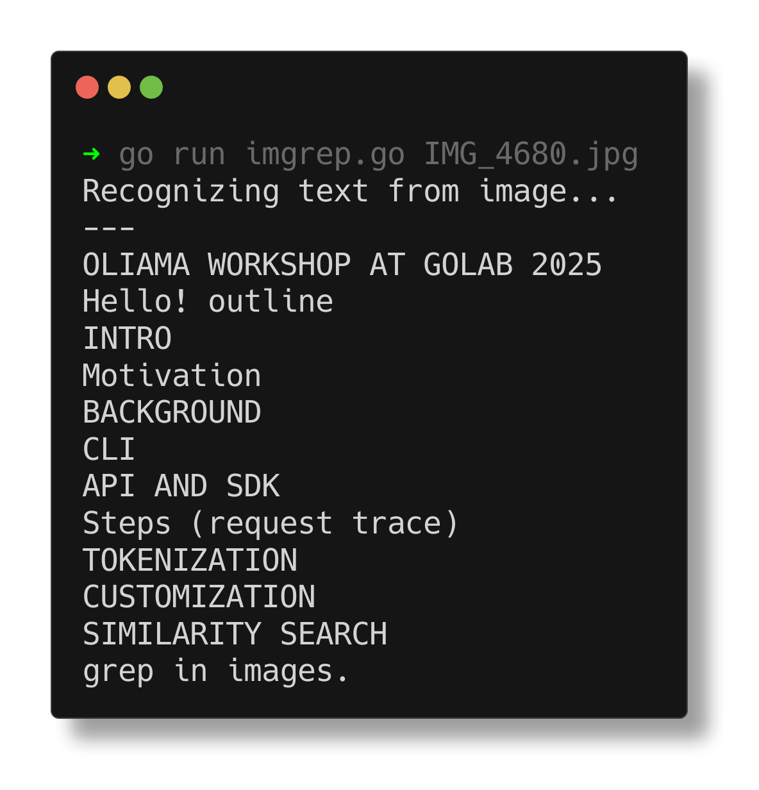

## Wrapup

* prompt hacking project ideas

